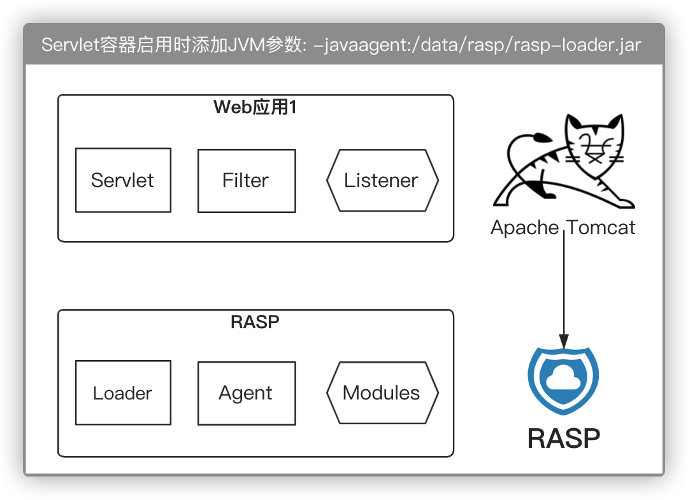
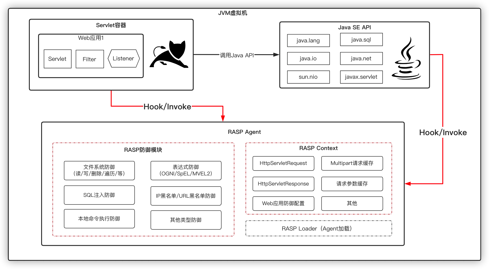
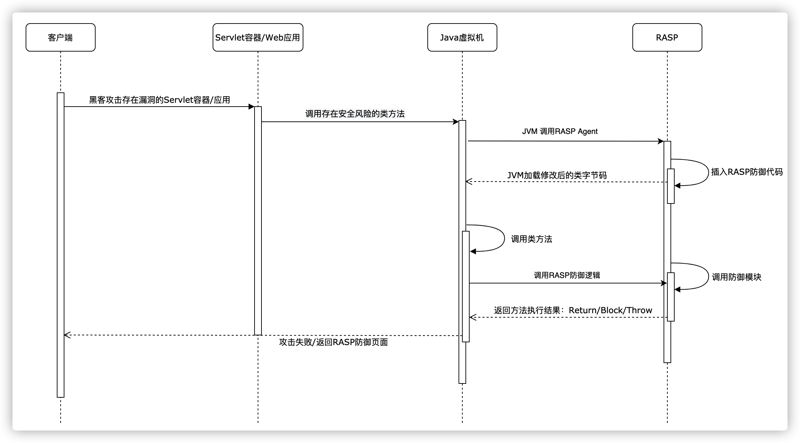
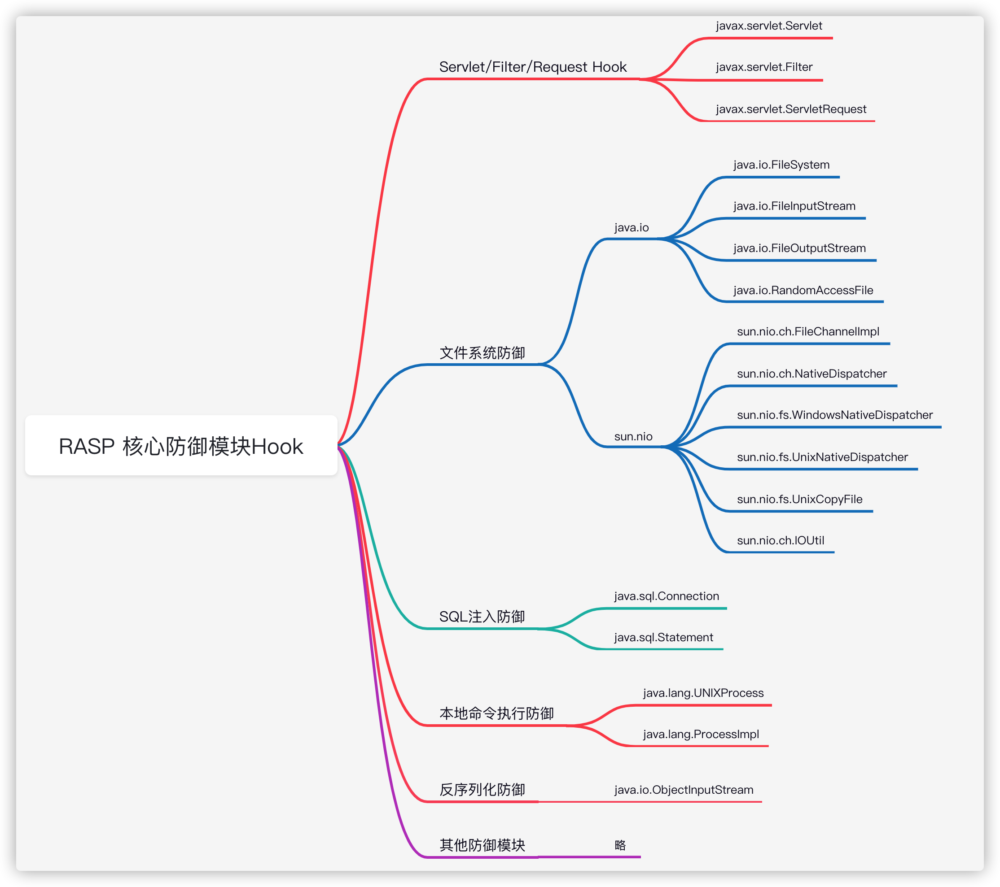

# JavaWeb RASP SDK

该项目是Java RASP的SDK，引入`rasp-agent-commons`即可开发RASP防御模块，添加如下依赖：

```xml
<dependency>
    <groupId>org.javaweb.rasp</groupId>
    <artifactId>rasp-agent-commons</artifactId>
    <version>3.0.3</version>
    <scope>provided</scope>
</dependency>
```


## RASP技术原理

在Java语言中，从`JDK1.5`开始新增了`Instrumentation（Java Agent API）`和`JVMTI（JVM Tool Interface）` API（Java Agent机制），允许JVM在加载某个class文件之前对其字节码进行修改，同时也支持对已加载的class（类字节码）进行重新加载（`Retransform`）。

利用`Java Agent`技术衍生出了`APM（Application Performance Management，应用性能管理）`、`RASP（Runtime application self-protection，运行时应用自我保护）`、`IAST（Interactive Application Security Testing，交互式应用程序安全测试）`等相关产品，它们都无一例外的使用了`Instrumentation/JVMTI`的`API`来实现动态修改Java类字节码并插入监控或检测代码。


## RASP Agent

RASP借助Agent机制，在Java底层与安全相关的类方法中设置了防御点，当JVM加载被RASP监控的类时会调用RASP的防御代码，从而触发RASP的主动防御。

**RASP运行原理 ：**



启动Servlet容器时需要添加JVM启动参数，如：`-javaagent:/data/rasp/rasp-loader.jar`，Agent注册好后会开始监控待加载的类，当有HTTP请求时RASP会劫持该请求（Filter/Servlet）并存入RASP上下文用于防御模块（Modules）检测。


## Agent整体架构

RASP由两大核心机制（`Agent机制`、`Hook机制`）、四大核心模块（`RASP Loader（加载RASP Agent）`、`RASP Transformer（ASM字节码编辑）`、`RASP Context（RASP上下文，存储请求相关对象）`、`RASP 防御模块`）组成。




## RASP防御原理

RASP防御的核心就是在Web应用程序执行关键的Java API之前插入防御逻辑，从而控制原类方法执行的业务逻辑，RASP是基于`事件驱动`机制来防御攻击行为的，即以防御类方法调用为核心，监控类方法的`onMethodEnter（方法进入）`、`onMethodEnter（方法退出）`、`onMethodEnter（方法异常）`三类事件。

**示例 - com.mysql.jdbc.ConnectionImpl类防御示例：**

```java
public class ConnectionImpl extends ConnectionPropertiesImpl implements MySQLConnection {
  
  	// 省略无关代码

    public PreparedStatement prepareStatement(String sql) throws SQLException {
        Object[] args = new Object[]{sql};

        // 生成try/catch
        try {
            // 调用RASP方法进入时检测逻辑
            HookResult<?> hookResult = HookProxy.processHookEvent(this, args, ...);
          
          	// RASP调用Hook处理后的结果类型
            HookResultType resultType = hookResult.getRASPHookResultType();

            if (REPLACE_OR_BLOCK == resultType) {
              	// 如果RASP检测结果需要阻断或替换程序执行逻辑，return RASP返回结果中设置的返回值
              	return (PreparedStatement) hookResult.getReturnValue();
            } else if (THROW == resultType) {
              	// 如果RASP检测结果需要往外抛出异常，throw RASP返回结果中设置的异常对象
              	throw (Throwable) hookResult.getException();
            }

            // ------------------------------------------------------------------------------------------
            // 执行程序原始逻辑
            PreparedStatement returnValue = prepareStatement(sql, RESULT_SET_TYPE, RESULT_SET_CONCURRENCY);
            // ------------------------------------------------------------------------------------------

            // 调用方法退出时候RASP检测逻辑，同onMethodEnter，此处省略对应代码

            return returnValue;
        } catch (Throwable t) {
            // 调用方法异常时RASP检测逻辑，同onMethodEnter，此处省略对应代码
        }
    }
}
```

当Web应用接入RASP防御后，RASP会在Java语言底层重要的API（如：文件读写、命令执行、SQL注入等API）中设置防御点（API Hook方式），攻击者一旦发送Web攻击请求就会被RASP监控并拦截，从而有效的防御Web攻击。

**示例 - RASP防御原理：**




## RASP Hook

Hook机制类似于AOP机制（`Aspect Oriented Programming`，面向切面编程），使用基于Java Agent实现的Hook技术，RASP可以实现对Java类方法执行执行前后插入自定义逻辑，从而实现控制原本的程序执行的业务逻辑。

通过总结常见的Web攻击，RASP归纳出了所有常见的攻击行为会触发的Java接口和类，并针对这些Java接口/类进行Hook，让RASP控制这些容易受到攻击的Java API。



`rasp-hooks/rasp-hook-cmd`提供了一个可参考的`本地系统命令执行`防御示例，任何一个防御模块都必须实现`org.javaweb.rasp.commons.hooks.RASPClassHook`接口，然后通过注解的方式配置Hook信息，示例代码如下：

```java
package org.javaweb.rasp.agent.hooks.cmd;

import org.javaweb.rasp.commons.MethodHookEvent;
import org.javaweb.rasp.commons.RASPModuleType;
import org.javaweb.rasp.commons.hooks.RASPClassHook;
import org.javaweb.rasp.commons.hooks.RASPMethodAdvice;
import org.javaweb.rasp.commons.hooks.RASPMethodHook;
import org.javaweb.rasp.commons.loader.hooks.HookResult;

import java.util.ArrayList;
import java.util.List;
import java.util.Map;

import static org.javaweb.rasp.agent.hooks.cmd.handler.LocalCommandHookHandler.processCommand;
import static org.javaweb.rasp.commons.RASPLogger.moduleErrorLog;
import static org.javaweb.rasp.commons.constants.RASPConstants.DEFAULT_HOOK_RESULT;
import static org.javaweb.rasp.commons.utils.ReflectionUtils.invokeFieldProxy;

/**
 * RASP防御本地系统命令执行示例
 */
public class LocalCommandHook implements RASPClassHook {

   public static final RASPModuleType cmdType = new RASPModuleType("cmd", "本地命令执行");

   /**
    * Hook ProcessBuilder类的start方法
    */
   @RASPMethodHook(className = "java.lang.ProcessBuilder", methodName = "start", requireRequest = false)
   public static class ProcessBuilderHook extends RASPMethodAdvice {

      @Override
      public HookResult<?> onMethodEnter(MethodHookEvent event) {
         Object obj = event.getThisObject();

         try {
            // 获取ProcessBuilder类的command变量值
            List<String> commandList = new ArrayList<String>();
            List<String> command     = invokeFieldProxy(obj, "command");

            if (command != null) {
               commandList.addAll(command);
            }

            // 获取ProcessBuilder类的environment变量
            Map<String, String> environment = invokeFieldProxy(obj, "environment");

            if (environment != null) {
               for (String key : environment.keySet()) {
                  commandList.add(key);
                  commandList.add(environment.get(key));
               }
            }

            // 调用processCommand方法，检测执行的本地命令合法性
            return processCommand(commandList, event);
         } catch (Exception e) {
            moduleErrorLog(cmdType, e);
         }

         return DEFAULT_HOOK_RESULT;
      }

   }

}
```


## RASP 防御检测

编写RASP防御逻辑之前必须要先检测当前线程中是否有HTTP请求，因为如果没有请求存在就无法创建`RASPHttpRequestContext`（RASP上下文），同时还必须检测当前的防御模块是否开启。

当检测到存在恶意攻击时应当立即添加攻击日志并阻断请求：

```java
// 添加攻击日志记录
context.addAttackInfo(new RASPAttackInfo(cmdType, key, commands, position, event, true));

return BLOCK_RESULT;
```

**示例 - RASP防御本地系统命令执行检测代码：**

```java
package org.javaweb.rasp.agent.hooks.cmd.handler;

import org.javaweb.rasp.commons.MethodHookEvent;
import org.javaweb.rasp.commons.attack.RASPAttackInfo;
import org.javaweb.rasp.commons.attack.RASPParameterPosition;
import org.javaweb.rasp.commons.cache.RASPCachedParameter;
import org.javaweb.rasp.commons.cache.RASPCachedRequest;
import org.javaweb.rasp.commons.context.RASPHttpRequestContext;
import org.javaweb.rasp.commons.hooks.RASPHookException;
import org.javaweb.rasp.commons.loader.hooks.HookResult;
import org.javaweb.rasp.commons.utils.StringUtils;

import java.util.List;
import java.util.Set;

import static org.javaweb.rasp.agent.hooks.cmd.LocalCommandHook.cmdType;
import static org.javaweb.rasp.commons.constants.RASPConstants.DEFAULT_HOOK_RESULT;
import static org.javaweb.rasp.commons.loader.hooks.HookResultType.THROW;

/**
 * RASP防御本地系统命令执行示例
 * Creator: yz
 * Date: 2019-07-23
 */
public class LocalCommandHookHandler {

   private static final HookResult<?> BLOCK_RESULT = new HookResult<Object>(THROW, new RASPHookException(cmdType));

   /**
    * 本地命令执行拦截模块，如果系统执行的CMD命令和请求参数完全一致则直接拦截
    *
    * @param command 执行的系统命令
    * @param event   Hook事件
    * @return Hook处理结果
    */
   public static HookResult<?> processCommand(List<String> command, MethodHookEvent event) {
      String[] commands = command.toArray(new String[0]);

      // 如果当前线程中不包含HTTP请求则不需要检测
      if (event.hasRequest()) {
         RASPHttpRequestContext context       = event.getRASPContext();
         RASPCachedRequest      cachedRequest = context.getCachedRequest();

         // 检测当前请求是否需要经过安全模块检测和过滤且该模块是否是开启状态
         if (!context.mustFilter(cmdType)) {
            return DEFAULT_HOOK_RESULT;
         }

         Set<RASPCachedParameter> cachedParameters = cachedRequest.getCachedParameter();

         // 只过滤请求参数值，忽略请求参数名称，因为参数名出现命令执行的概率太低
         for (RASPCachedParameter parameterValue : cachedParameters) {
            // 请求参数名称
            String key = parameterValue.getKey();

            // 请求参数值
            String[] values = parameterValue.getValue();

            // 请求参数出现的位置
            RASPParameterPosition position = parameterValue.getRaspAttackPosition();

            // 遍历所有的参数值
            for (String value : values) {
               if (StringUtils.isEmpty(value)) {
                  continue;
               }

               // 遍历被执行的系统命令
               for (String cmd : commands) {
                  if (value.equals(cmd)) {
                     // 添加攻击日志记录
                     context.addAttackInfo(new RASPAttackInfo(cmdType, key, commands, position, event, true));

                     return BLOCK_RESULT;
                  }
               }
            }
         }

      }

      return DEFAULT_HOOK_RESULT;
   }

}
```

编写好的防御模块build成功后需要放到`rasp/hooks`目录即可自动加载。


## RASPMethodHook/RASPMethodHooks

定义一个Hook点必须使用`@RASPMethodHook`注解，`@RASPMethodHook`注解是用于标注Hook点配置信息的，如`superClasses`（Hook的父类名称）、`className`（Hook类名）、`methodName`（Hook方法名）、`methodNameRegexp`（Hook方法名是否使用正则表达式匹配）等，如果多个注解标注的Hook点可以使用同一个Hook类处理，那么可以使用，如下：

```java
@RASPMethodHooks({
  @RASPMethodHook(
      superClasses = "jakarta.servlet.Servlet", methodName = "service",
      methodArgsDesc = JAKARTA_ARGS_TYPE, requireRequest = false, requestEntry = true
  ),
  @RASPMethodHook(
      superClasses = "jakarta.servlet.FilterChain", methodName = "doFilter",
      methodArgsDesc = JAKARTA_ARGS_TYPE, requireRequest = false, requestEntry = true
  )
})
public static class JakartaHttpRequestHook extends RASPMethodAdvice {
    @Override
		public HookResult<?> onMethodEnter(MethodHookEvent event) {
			return onRequestEnter(event, false);
		}
}
```


## RASPMethodAdvice

`RASPMethodAdvice`用于处理Hook方法事件，该事件分类三大类型，分别对应类方法调用的执行前、后、异常，Hook事件分类：`onMethodEnter`（方法进入前）、`onMethodExit`（方法退出后 ）、`onMethodThrow`（方法异常时），任何一个Hook点都必须重写`RASPMethodAdvice`类的其中一个方法，否则Hook没有意义。


## RASPHttpRequestContext

`RASPHttpRequestContext`（RASP上下文）是在HTTP请求时自动创建的，RASP上下文中包含了使用Hook方式劫持到的`HttpServletRequestProxy/HttpServletResponseProxy`、`openModules`（RASP开发的防御模块列表）、`applicationConfig`（当前访问的W而不应用配置信息）等。


## MethodHookEvent

`MethodHookEvent`中包含了`RASPHttpRequestContext`（RASP上下文）和被Hook的类方法调用信息，如被Hook的类`thisClass`、类方法`thisMethodName`、类方法参数值`thisArgs`等。


## HookResult

`HookResult`是RASP防御模块处理结果对象，返回的结果可以为：`RETURN`（直接返回什么都不做）、`THROW`（抛出异常）、`REPLACE_OR_BLOCK`（阻断或替换值），如果返回类型为`REPLACE_OR_BLOCK`则必须提供一个与当前Hook类方法类型一致的返回值否则可能会导致栈异常，如：

```java
return new HookResult<String[]>(REPLACE_OR_BLOCK, new String[]{"test"});
```


## 注意事项

1. 为了避免产生兼容性问题请勿在防御模块中使用jni、多线程；
2. 您所编写的防御模块和所依赖库第三方库必须支持JDK1.6；
3. 如果防御模块依赖了第三方库，必须将防御模块和依赖库打包到一起；


